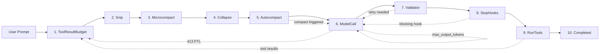

# cpp-agent / C++ 智能编程代理

**A high-performance C++17 AI coding agent** — a faithful native reimplementation of the `local-ace` TypeScript agent, engineered for 8-hour continuous operation with automatic context compaction, multi-model fallback, sub-agent coordination, and a full hook lifecycle system.

**高性能 C++17 智能编程代理** — 从 `local-ace` TypeScript 工程忠实重构的原生实现，支持 8 小时连续运行，具备自动上下文压缩、多模型回退、子代理协调和完整钩子生命周期系统。

---

## Table of Contents / 目录

- [Architecture Overview / 架构概览](#architecture-overview--架构概览)
- [System Architecture Diagram / 系统架构图](#system-architecture-diagram--系统架构图)
- [Data Flow Diagram / 数据流图](#data-flow-diagram--数据流图)
- [Use Case Diagram / 用例图](#use-case-diagram--用例图)
- [Module Reference / 模块参考](#module-reference--模块参考)
- [Feature Parity with local-ace / 与 local-ace 的功能对齐](#feature-parity-with-local-ace--与-local-ace-的功能对齐)
- [Build & Run / 构建与运行](#build--run--构建与运行)
- [Configuration / 配置](#configuration--配置)
- [Testing / 测试](#testing--测试)
- [Project Structure / 项目结构](#project-structure--项目结构)

---

## Architecture Overview / 架构概览

cpp-agent follows a **four-layer architecture** that cleanly separates concerns:

cpp-agent 采用 **四层架构**，清晰地分离了各关注点：

| Layer / 层 | Modules / 模块 | Responsibility / 职责 |
|---|---|---|
| **Core** 内核 | `QueryEngine`, `QueryLoop`, `AgentTypes`, `StateTypes`, `StreamingToolExecutor`, `LocalValidator`, `AppStateStore` | Agent reasoning loop, state machine, model interaction, validation |
| **Tools & Permissions** 工具与权限 | `ToolRegistry`, `ToolOrchestrator`, `PermissionEngine`, `BashClassifier`, `PathValidator`, `SandboxEnforcer`, 12 built-in tools | Tool registration, parallel execution, permission gating, sandbox |
| **Infrastructure** 基础设施 | `ProcessRunner`, `SessionManager`, `StabilityWatchdog`, `MemoryIndex`, `SessionMemory`, `AutoDream`, `Logger`, `ThreadPool`, `StringUtil`, `EnvUtil` | Process execution, session persistence, stability monitoring, memory |
| **API & Integration** API与集成 | `ModelClient` (Anthropic + OpenAI), `SideQueryClient`, `CostTracker`, `McpClientManager`, `SubAgentManager`, `CoordinatorMode`, `HookExecutor` | LLM communication, MCP protocol, sub-agent orchestration, hooks |

### Design Principles / 设计原则

- **local-ace parity**: Every module mirrors a specific local-ace TypeScript module, maintaining behavioral equivalence
- **Dependency injection**: Components receive dependencies via constructors/setters, not global state
- **Model-family awareness**: System prompts, context windows, and tool formats adapt per model (Claude, Qwen, Gemma, MiMo)
- **Fail-closed security**: Permission defaults to deny; circuit breaker after 3 consecutive denials
- **8-hour stability**: Watchdog monitoring, heartbeat, memory tracking, automatic snapshot recovery

---

## System Architecture Diagram / 系统架构图

```mermaid
graph TB
    User[User / 用户] --> CLI[agent_cli main.cpp]
    CLI --> QE[QueryEngine]
    CLI --> Hooks[HookExecutor]
    
    QE --> QL[QueryLoop State Machine]
    QE --> MC[ModelClient HTTP/SSE]
    QE --> TO[ToolOrchestrator]
    QE --> PE[PermissionEngine]
    QE --> SM[SessionManager]
    QE --> WD[StabilityWatchdog]
    QE --> MEM[MemoryIndex]
    QE --> SA[SubAgentManager]
    
    QL --> Stages[10-Stage Pipeline]
    Stages --> S1[ToolResultBudget]
    Stages --> S2[Snip / Microcompact]
    Stages --> S3[Collapse / Autocompact]
    Stages --> S4[ModelCall / Validator]
    Stages --> S5[StopHooks / RunTools]
    
    TO --> TR[ToolRegistry]
    TO --> Tools[Built-in Tools]
    Tools --> T1[Bash]
    Tools --> T2[FileRead/FileWrite/FileEdit]
    Tools --> T3[Grep/Glob]
    Tools --> T4[WebFetch/WebSearch]
    Tools --> T5[TodoWrite/TaskCreate]
    Tools --> T6[NotebookEdit]
    
    TO --> MCP[McpClientManager]
    MCP --> MCPServers[MCP Servers]
    
    PE --> BC[BashClassifier]
    PE --> PV[PathValidator]
    
    SA --> Workers[Sub-Agent Workers]
    SA --> WT[Git Worktrees]
    
    SM --> Disk[Session Persistence]
    MEM --> MemoryDisk[Memory Files]
    
    Hooks --> HookConfig[Hook Configuration]
    HookConfig --> ShellHooks[Shell Commands]
    HookConfig --> CallbackHooks[Internal Callbacks]
    
    MC --> Anthropic[Anthropic API]
    MC --> OpenAI[OpenAI-Compatible API]
    MC --> Retry[Retry + Backoff]
    
    WD --> Monitor[Health Monitor Thread]
```



---

## Data Flow Diagram / 数据流图

The core reasoning cycle follows a **10-stage state machine** in `QueryLoop::RunFull()`:

核心推理循环在 `QueryLoop::RunFull()` 中遵循 **10 阶段状态机**：



### Stage Details / 阶段详情

| Stage | Function / 函数 | Purpose / 目的 |
|---|---|---|
| ToolResultBudget | `ApplyStepBudget()` | Trim oversized tool results to fit context window / 裁剪过大的工具结果 |
| Snip | `ApplyStepSnip()` | History snip projection for old messages / 旧消息的历史裁剪投影 |
| Microcompact | `ApplyStepMicrocompact()` | Clear stale Read/Grep/Bash results, keep recent N / 清除陈旧结果，保留最近 N 条 |
| Collapse | `ApplyStepCollapse()` | Summarize old message groups when context is large / 上下文过大时摘要旧消息组 |
| Autocompact | `ApplyStepAutocompact()` | Full LLM-driven compaction near context limit / 接近上下文限制时进行 LLM 驱动的压缩 |
| ModelCall | `ApplyStepModelCall()` | Call LLM via HTTP/SSE, parse response blocks / 通过 HTTP/SSE 调用 LLM，解析响应 |
| Validator | `ApplyStepValidator()` | Local rule validation + optional LLM validator / 本地规则验证 + 可选 LLM 验证器 |
| StopHooks | `ExecuteStopHooks()` | Run Stop hooks, check if agent should continue / 运行 Stop 钩子，检查是否继续 |
| RunTools | `ApplyStepRunTools()` | Partition & execute tool calls (parallel + sequential) / 分区并执行工具调用 |
| Completed | `ApplyStepTerminate()` | Terminal reason, notification hooks, cleanup / 终止原因、通知钩子、清理 |

---

## Use Case Diagram / 用例图

```mermaid
graph TB
    Developer[Developer / 开发者] --> UC1[Interactive Coding Session]
    Developer --> UC2[Pipe/Scripted Mode]
    Developer --> UC3[Session Resume]
    
    UC1 --> UC1a[Multi-turn File Editing]
    UC1 --> UC1b[Bash Command Execution]
    UC1 --> UC1c[Code Search Grep/Glob]
    UC1 --> UC1d[Web Research]
    UC1 --> UC1e[Task Management]
    
    UC2 --> UC2a[CI/CD Integration]
    UC2 --> UC2b[Automated Code Review]
    
    UC3 --> UC3a[Snapshot Restore]
    UC3 --> UC3b[Transcript Replay]
    
    Coordinator[Coordinator Mode] --> UC4[Sub-Agent Delegation]
    UC4 --> UC4a[Parallel Worker Tasks]
    UC4 --> UC4b[Git Worktree Isolation]
    
    System[System / 系统] --> UC5[Auto Context Compaction]
    System --> UC6[Memory Consolidation AutoDream]
    System --> UC7[Stability Monitoring]
    System --> UC8[Hook Lifecycle Events]
    
    MCP_External[MCP Servers] --> UC9[External Tool Integration]
```



### Key Use Cases / 关键用例

| Use Case / 用例 | Description / 描述 |
|---|---|
| **Interactive Coding** | Developer runs `agent_cli`, submits prompts, agent reads/writes files, runs bash, searches code |
| **Pipe Mode** | `echo "fix bug" \| agent_cli --pipe` for non-interactive scripted workflows |
| **Session Resume** | Agent restores from `snapshot.pb`, recovering messages, sub-agent tasks, and executor state |
| **Sub-Agent Delegation** | Coordinator spawns isolated workers with tool whitelists and git worktree isolation |
| **Auto Compaction** | 5-tier context management (budget → snip → micro → collapse → autocompact) keeps conversations running for hours |
| **Hook Integration** | 27 hook events (PreToolUse, PostToolUse, Stop, SessionStart/End, Notification, etc.) fire shell commands or callbacks |
| **MCP Integration** | External MCP servers provide additional tools, resources, and prompts via standardized protocol |

---

## Module Reference / 模块参考

### Core Layer / 核心层

| Module | File | Lines | Description / 描述 |
|---|---|---|---|
| `QueryLoop` | `core/QueryLoop.cpp` | ~3860 | 10-stage state machine, main agent loop / 10阶段状态机，主代理循环 |
| `QueryEngine` | `core/QueryEngine.cpp` | ~800 | Orchestrates QueryLoop, manages config injection / 编排 QueryLoop，管理配置注入 |
| `AgentTypes` | `core/AgentTypes.h` | 226 | Message, ContentBlock, BlockType, ModelFamily, QueryStage / 核心数据类型 |
| `StateTypes` | `core/StateTypes.h` | 225 | AgentConfig, LlmConfig, PermissionMode, SessionMetadata / 配置与状态类型 |
| `StreamingToolExecutor` | `core/StreamingToolExecutor.cpp` | ~200 | Execute tools as SSE tokens stream in / 流式工具执行器 |
| `LocalValidator` | `core/LocalValidator.cpp` | ~500 | Rule-based validation without LLM / 基于规则的本地验证 |
| `AppStateStore` | `core/AppStateStore.cpp` | ~150 | Global application state key-value store / 全局应用状态存储 |

### Tools & Permissions / 工具与权限层

| Module | File | Description / 描述 |
|---|---|---|
| `Tool` (interface) | `tools/Tool.h` | Base class with validation, permissions, rendering / 工具基类接口 |
| `ToolRegistry` | `tools/ToolRegistry.h` | Tool registration, lookup by name/alias / 工具注册与查找 |
| `ToolOrchestrator` | `tools/ToolOrchestratorNew.cpp` | Parallel + sequential tool execution with hooks / 并行+顺序工具执行 |
| `PermissionEngine` | `permissions/PermissionEngine.h` | Allow/deny rules, classifier, circuit breaker / 权限引擎与熔断器 |
| `BashClassifier` | `permissions/BashClassifier.h` | LLM-based bash command safety classification / 基于 LLM 的命令安全分类 |
| `SandboxEnforcer` | `sandbox/SandboxEnforcer.h` | Command filtering, path boundary, network restriction / 沙箱执行器 |
| **Built-in Tools** | `tools/BashTool.cpp` | Shell command execution with timeout / Shell 命令执行 |
| | `tools/FileReadTool.cpp` | File reading with line ranges / 文件读取 |
| | `tools/FileWriteTool.cpp` | File creation and overwriting / 文件创建与覆写 |
| | `tools/FileEditTool.cpp` | Search-replace file editing / 搜索替换编辑 |
| | `tools/GrepTool.cpp` | Regex search via ripgrep / 正则搜索 |
| | `tools/GlobTool.cpp` | File pattern matching / 文件模式匹配 |
| | `tools/WebFetchTool.cpp` | HTTP page fetching / 网页获取 |
| | `tools/WebSearchTool.cpp` | Web search integration / 网页搜索 |
| | `tools/TodoWriteTool.cpp` | Task tracking / 任务追踪 |
| | `tools/TaskCreateTool.cpp` | Sub-agent task creation / 子代理任务创建 |
| | `tools/NotebookEditTool.cpp` | Jupyter notebook editing / Jupyter 笔记本编辑 |

### Infrastructure / 基础设施层

| Module | File | Description / 描述 |
|---|---|---|
| `ProcessRunner` | `infra/ProcessRunner.cpp` | Windows process spawning with timeout / Windows 进程创建与超时 |
| `SessionManager` | `infra/SessionManager.cpp` | Snapshot persistence, transcript logging / 会话快照持久化 |
| `StabilityWatchdog` | `infra/StabilityWatchdog.cpp` | Health monitor thread, heartbeat, recovery / 健康监控与恢复 |
| `MemoryIndex` | `memory/MemoryIndex.cpp` | MEMORY.md entrypoint, topic files, relevance search / 记忆索引与检索 |
| `SessionMemory` | `memory/SessionMemory.cpp` | Per-session CRUD memory store / 会话级记忆存储 |
| `AutoDream` | `memory/AutoDream.cpp` | 4-phase background memory consolidation / 4阶段后台记忆整合 |
| `Logger` | `infra/Logger.cpp` | Structured logging with levels / 结构化日志 |
| `ThreadPool` | `infra/ThreadPool.cpp` | Generic thread pool for async work / 通用线程池 |

### API & Integration / API 与集成层

| Module | File | Description / 描述 |
|---|---|---|
| `ModelClient` | `api/ModelClient.cpp` | Anthropic + OpenAI HTTP with SSE streaming + retry / LLM 通信与重试 |
| `SideQueryClient` | `api/SideQueryClient.cpp` | Lightweight queries for classifier/validator / 轻量查询 |
| `CostTracker` | `api/CostTracker.cpp` | Token usage and cost tracking (singleton) / 令牌用量追踪 |
| `McpClientManager` | `mcp/McpClientManager.cpp` | MCP protocol client with transport abstraction / MCP 协议客户端 |
| `SubAgentManager` | `agents/SubAgentManager.cpp` | Sub-agent lifecycle, executor scheduling, worktrees / 子代理管理 |
| `CoordinatorMode` | `agents/CoordinatorMode.cpp` | Multi-agent swarm coordination / 多代理协调 |
| `HookExecutor` | `hooks/HookExecutor.cpp` | Hook execution engine (command + callback) / 钩子执行引擎 |
| `HookConfig` | `hooks/HookConfig.cpp` | Hook configuration loading and matching / 钩子配置加载 |

### Compact Engine / 压缩引擎 (10 modules)

| Module | Description / 描述 |
|---|---|
| `CompactEngine` | Core compaction: boundary markers, summaries, hook merging / 核心压缩引擎 |
| `AutoCompact` | Token-threshold auto-compact with circuit breaker / 自动压缩与熔断器 |
| `MicroCompact` | Clear stale tool results (Read/Grep/Bash) / 清除陈旧工具结果 |
| `ContextCollapse` | Message summarization and truncation / 消息摘要与截断 |
| `SnipProjection` | History snip pass-through (currently no-op) / 历史裁剪投影 |
| `MessageGrouping` | Group messages by semantic role for compaction / 消息语义分组 |
| `PostCompactCleanup` | Remove orphaned tool results after compact / 压缩后清理 |
| `CompactPrompt` | Build compaction prompts for LLM / 构建压缩提示词 |
| `SessionMemoryCompact` | Compact session memory records / 会话记忆压缩 |
| `TimeBasedMCConfig` | Time-based microcompact triggers / 基于时间的微压缩 |

---

## Feature Parity with local-ace / 与 local-ace 的功能对齐

| Feature / 功能 | local-ace (TypeScript) | cpp-agent (C++) | Status / 状态 |
|---|---|---|---|
| Query Loop (10-stage state machine) | `queryLoop.ts` | `QueryLoop.cpp` | ✅ Parity |
| Tool System (12+ tools) | `tools/*.ts` | `tools/*.cpp` | ✅ Parity |
| Parallel Tool Execution | `toolOrchestrator.ts` | `ToolOrchestratorNew.cpp` | ✅ Parity |
| Permission Engine + Classifier | `permissions/*.ts` | `permissions/*.cpp` | ✅ Parity |
| Auto Compact (5-tier) | `compact/*.ts` | `compact/*.cpp` | ✅ Parity |
| Hook System (27 events) | `hooks/*.ts` | `hooks/*.cpp` | ✅ Parity |
| PreToolUse / PostToolUse Hooks | `executeHooks()` | `RunPreToolUseHooks()` / `RunPostToolUseHooks()` | ✅ Wired |
| Session Start/End Hooks | `sessionHooks.ts` | `RunSessionStartHooks()` / `RunSessionEndHooks()` | ✅ Wired |
| Stop / StopFailure Hooks | `stopHooks.ts` | `RunStopHooks()` / `RunStopFailureHooks()` | ✅ Wired |
| UserPromptSubmit Hooks | `userPromptSubmit.ts` | `RunUserPromptSubmitHooks()` | ✅ Wired |
| Notification Hooks | `notifier.ts` | `RunNotificationHooks()` | ✅ Wired |
| Sub-Agent Manager | `subAgentManager.ts` | `SubAgentManager.cpp` | ✅ Parity |
| Coordinator Mode | `coordinatorMode.ts` | `CoordinatorMode.cpp` | ✅ Parity |
| MCP Client | `mcpClient.ts` | `McpClientManager.cpp` | ✅ Parity |
| Memory Index + AutoDream | `memory/*.ts` | `memory/*.cpp` | ✅ Parity |
| Session Persistence | `sessionManager.ts` | `SessionManager.cpp` | ✅ Parity |
| Stability Watchdog | N/A (added) | `StabilityWatchdog.cpp` | ✅ Enhanced |
| Model Family Detection | `modelUtils.ts` | `AgentTypes.h DetectModelFamily()` | ✅ Parity |
| HTTP Retry with Backoff | `withRetry.ts` | `SendHttpPostWithRetry()` | ✅ Parity |
| Cost Tracking | `costTracker.ts` | `CostTracker.cpp` | ✅ Parity |
| Sandbox Enforcement | `sandbox.ts` | `SandboxEnforcer.cpp` | ✅ Parity |
| Local Validator | `validation/*.ts` | `LocalValidator.cpp` | ✅ Parity |
| Streaming SSE | `streaming.ts` | `StreamResponse()` | ✅ Parity |
| TUI Task Panel | `tui/*.ts` | `TuiTaskPanel.cpp` | ✅ Parity |

---

## Build & Run / 构建与运行

### Prerequisites / 前置条件

- **Windows**: Visual Studio 2017+ (MSVC), CMake 3.20+
- **Linux**: GCC 9+ or Clang 12+, CMake 3.20+, libcurl-dev
- **Dependencies**: nlohmann/json (vendored in `src/third_party/`)

### Build / 构建

```powershell
# Windows (Visual Studio)
cmake -S . -B build -G "Visual Studio 17 2022" -A x64
cmake --build build --config Release

# Linux
cmake -S . -B build -DCMAKE_BUILD_TYPE=Release
cmake --build build --config Release
```

### Run / 运行

```powershell
# Interactive mode / 交互模式
.\build\Release\agent_cli.exe

# Pipe mode / 管道模式
echo "Create a hello world Python script" | .\build\Release\agent_cli.exe --pipe

# With custom model endpoint / 自定义模型端点
$env:AGENT_API_ENDPOINT = "http://localhost:8080/v1"
$env:AGENT_API_KEY = "your-key"
$env:AGENT_MODEL = "gemma-4-31b"
.\build\Release\agent_cli.exe
```

### Environment Variables / 环境变量

| Variable | Description / 描述 | Default |
|---|---|---|
| `AGENT_API_ENDPOINT` | LLM API endpoint / LLM API 端点 | `https://api.anthropic.com` |
| `AGENT_API_KEY` | API authentication key / API 密钥 | — |
| `AGENT_MODEL` | Main model name / 主模型名 | `claude-sonnet-4-20250514` |
| `AGENT_FALLBACK_MODEL` | Fallback model on 413/error / 回退模型 | — |
| `AGENT_VALIDATOR_MODEL` | Validator model / 验证器模型 | — |
| `CPP_AGENT_CONTEXT_WINDOW` | Override context window size / 覆盖上下文窗口大小 | Model-dependent |
| `AGENT_BASH_TIMEOUT_MS` | Bash tool timeout / Bash 超时 | `120000` |
| `AGENT_DISABLE_VALIDATION` | Disable local validator / 禁用验证 | `0` |

---

## Configuration / 配置

### CMake Build Options / CMake 构建选项

| Option | Default | Description / 描述 |
|---|---|---|
| `AGENT_BUILD_TESTS` | ON | Build unit and integration tests / 构建测试 |
| `AGENT_ENABLE_AUTOCOMPACT` | ON | Auto context compaction / 自动压缩 |
| `AGENT_ENABLE_VALIDATOR` | OFF | LLM validation layer / LLM 验证层 |
| `AGENT_ENABLE_MCP` | ON | MCP client integration / MCP 集成 |
| `AGENT_ENABLE_AUTODREAM` | ON | Background memory consolidation / 后台记忆整合 |
| `AGENT_ENABLE_STREAMING_TOOLS` | ON | Streaming tool execution / 流式工具执行 |
| `AGENT_ENABLE_SANDBOX` | OFF | OS-level sandbox / 系统级沙箱 |
| `AGENT_ENABLE_WEB_TOOLS` | OFF | WebFetch/WebSearch tools / 网页工具 |
| `AGENT_ENABLE_LOGGING` | ON | Structured logging / 结构化日志 |

### Session Directory Layout / 会话目录布局

```
.cpp-agent/
├── session/
│   ├── snapshot.pb          # Binary session snapshot / 二进制会话快照
│   ├── transcript.jsonl      # Message transcript log / 消息转录日志
│   └── main_model_io.jsonl  # Model I/O debug log / 模型IO调试日志
└── memory/
    ├── MEMORY.md            # Memory index entrypoint / 记忆索引入口
    └── *.md                 # Topic memory files / 主题记忆文件
```

---

## Testing / 测试

The project includes **35+ test executables** covering all modules:

项目包含 **35+ 测试可执行文件**，覆盖所有模块：

```powershell
# Run all tests / 运行所有测试
ctest --test-dir build -C Release --output-on-failure

# Run specific test suites / 运行特定测试套件
.\build\Release\agent_test_hooks.exe      # Hook system tests / 钩子系统
.\build\Release\agent_test_tools.exe      # Tool tests / 工具测试
.\build\Release\agent_test_core.exe       # Core loop tests / 核心循环
.\build\Release\agent_test_compact.exe    # Compact engine tests / 压缩引擎
.\build\Release\agent_test_memory.exe     # Memory system tests / 记忆系统
.\build\Release\agent_test_sandbox.exe    # Sandbox tests / 沙箱测试
.\build\Release\agent_test_mcp.exe        # MCP client tests / MCP 客户端
.\build\Release\agent_test_subagent.exe   # Sub-agent tests / 子代理
.\build\Release\agent_test_validator.exe  # Validator tests / 验证器
```

---

## Project Structure / 项目结构

```
cpp-agent/
├── CMakeLists.txt                    # Build configuration / 构建配置
├── src/
│   ├── agents/                       # Sub-agent management / 子代理管理
│   │   ├── CoordinatorMode.cpp/h     # Multi-agent coordination / 多代理协调
│   │   ├── SubAgentManager.cpp/h     # Task lifecycle & scheduling / 任务生命周期
│   │   ├── SubAgentWorkerMain.cpp    # Worker process entry / 工作进程入口
│   │   └── SubAgentWorkerProtocol.cpp/h # IPC protocol / IPC 协议
│   ├── api/                          # LLM API layer / LLM API 层
│   │   ├── CostTracker.cpp/h         # Token cost tracking / 令牌成本追踪
│   │   ├── ModelClient.cpp/h         # HTTP/SSE LLM client / HTTP/SSE 客户端
│   │   └── SideQueryClient.cpp/h     # Lightweight queries / 轻量查询
│   ├── app/                          # Application entry / 应用入口
│   │   ├── main.cpp                  # CLI entry point (2300+ lines) / CLI 入口
│   │   ├── RuntimePolicy.cpp/h       # Tool registration policy / 工具注册策略
│   │   └── TuiTaskPanel.cpp/h        # Terminal UI task panel / 终端任务面板
│   ├── compact/                      # Context compaction / 上下文压缩
│   │   ├── AutoCompact.cpp/h         # Auto-compact engine / 自动压缩
│   │   ├── CompactEngine.cpp/h       # Core compaction logic / 核心压缩逻辑
│   │   ├── CompactPrompt.cpp/h       # Compaction prompts / 压缩提示词
│   │   ├── ContextCollapse.cpp/h     # Collapse strategies / 折叠策略
│   │   ├── MicroCompact.cpp/h        # Micro-compact / 微压缩
│   │   ├── MessageGrouping.cpp/h     # Message grouping / 消息分组
│   │   ├── PostCompactCleanup.cpp/h  # Post-compact cleanup / 压缩后清理
│   │   ├── SessionMemoryCompact.cpp/h # Session memory compact / 会话记忆压缩
│   │   ├── SnipProjection.cpp/h      # Snip projection / 裁剪投影
│   │   └── TimeBasedMCConfig.cpp/h   # Time-based config / 时间配置
│   ├── core/                         # Agent core / 代理核心
│   │   ├── AgentTypes.h              # Core types (Message, Block, etc.) / 核心类型
│   │   ├── AppStateStore.cpp/h       # App state KV store / 应用状态存储
│   │   ├── LocalValidator.cpp/h      # Rule-based validator / 规则验证器
│   │   ├── QueryEngine.cpp/h         # Query orchestration / 查询编排
│   │   ├── QueryLoop.cpp/h           # 10-stage state machine / 10阶段状态机
│   │   ├── StateTypes.cpp/h          # Config & state types / 配置与状态
│   │   └── StreamingToolExecutor.cpp/h # Streaming tools / 流式工具
│   ├── hooks/                        # Hook system / 钩子系统
│   │   ├── HookConfig.cpp/h          # Hook configuration / 钩子配置
│   │   ├── HookExecutor.cpp/h        # Hook execution engine / 钩子执行引擎
│   │   └── HookTypes.h              # 27 hook event types / 27种钩子事件
│   ├── infra/                        # Infrastructure / 基础设施
│   │   ├── EnvUtil.cpp/h             # Environment utilities / 环境变量工具
│   │   ├── JsonUtil.h                # JSON helpers / JSON 工具
│   │   ├── Logger.cpp/h              # Structured logging / 结构化日志
│   │   ├── ProcessRunner.cpp/h       # Process execution / 进程执行
│   │   ├── ProtoLite.cpp/h           # Lightweight serialization / 轻量序列化
│   │   ├── SessionManager.cpp/h      # Session persistence / 会话持久化
│   │   ├── StabilityWatchdog.cpp/h   # Health monitoring / 健康监控
│   │   ├── StringUtil.cpp/h          # String utilities / 字符串工具
│   │   └── ThreadPool.cpp/h          # Thread pool / 线程池
│   ├── mcp/                          # MCP protocol / MCP 协议
│   │   ├── ChannelNotification.cpp/h # MCP notifications / MCP 通知
│   │   ├── ChannelPermissions.cpp/h  # MCP permissions / MCP 权限
│   │   └── McpClientManager.cpp/h    # MCP client manager / MCP 客户端管理
│   ├── memory/                       # Memory system / 记忆系统
│   │   ├── AutoDream.cpp/h           # Background consolidation / 后台整合
│   │   ├── ConsolidationLock.cpp/h   # Consolidation locking / 整合锁
│   │   ├── ConsolidationPrompt.cpp/h # Consolidation prompts / 整合提示
│   │   ├── ExtractMemories.cpp/h     # Memory extraction / 记忆提取
│   │   ├── MemoryIndex.cpp/h         # Memory index / 记忆索引
│   │   ├── MemoryScanner.cpp/h       # Memory scanning / 记忆扫描
│   │   └── SessionMemory.cpp/h       # Session memory / 会话记忆
│   ├── permissions/                  # Permission system / 权限系统
│   │   ├── BashClassifier.cpp/h      # Command safety classifier / 命令分类器
│   │   ├── PathValidator.cpp/h       # Path validation / 路径验证
│   │   ├── PermissionEngine.cpp/h    # Permission evaluation / 权限评估
│   │   └── PolicyLimits.cpp/h       # Policy limits / 策略限制
│   ├── platform/                     # Platform abstraction / 平台抽象
│   │   ├── Platform.h                # Platform interface / 平台接口
│   │   ├── PlatformPosix.cpp         # Linux/macOS implementation
│   │   └── PlatformWin32.cpp         # Windows implementation
│   ├── sandbox/                      # Sandbox enforcement / 沙箱执行
│   │   └── SandboxEnforcer.cpp/h     # Command/path/network filtering / 过滤
│   ├── third_party/                  # Vendored dependencies / 第三方依赖
│   │   └── nlohmann_json.hpp         # JSON library / JSON 库
│   └── tools/                        # Built-in tools / 内置工具
│       ├── BashTool.cpp/h            # Shell execution / Shell 执行
│       ├── BashHelpers.cpp/h         # Bash utilities / Bash 工具函数
│       ├── FileEditTool.cpp/h        # Search-replace editing / 搜索替换编辑
│       ├── FileHelpers.cpp/h         # File utilities / 文件工具函数
│       ├── FileReadTool.cpp/h        # File reading / 文件读取
│       ├── FileWriteTool.cpp/h       # File writing / 文件写入
│       ├── GlobTool.cpp/h            # File globbing / 文件匹配
│       ├── GrepTool.cpp/h            # Regex search / 正则搜索
│       ├── NotebookEditTool.cpp/h    # Notebook editing / 笔记本编辑
│       ├── TaskCreateTool.cpp/h      # Task creation / 任务创建
│       ├── TodoWriteTool.cpp/h       # Todo tracking / 待办追踪
│       ├── Tool.cpp/h                # Tool base class / 工具基类
│       ├── ToolOrchestratorNew.cpp   # Tool execution engine / 工具执行引擎
│       ├── ToolRegistry.cpp/h        # Tool registration / 工具注册
│       ├── ToolSearch.cpp/h          # Tool discovery / 工具发现
│       ├── WebFetchTool.cpp/h        # HTTP fetching / HTTP 获取
│       └── WebSearchTool.cpp/h       # Web search / 网页搜索
└── tests/
    ├── unit/                         # 35+ unit test files / 35+ 单元测试文件
    └── integration/                  # Integration tests / 集成测试
```

---

## Hook Events / 钩子事件

cpp-agent supports all **27 hook events** from local-ace:

cpp-agent 支持 local-ace 的所有 **27 种钩子事件**：

| Event | Wired / 已接入 | Description / 描述 |
|---|---|---|
| `PreToolUse` | ✅ | Before tool execution / 工具执行前 |
| `PostToolUse` | ✅ | After tool execution / 工具执行后 |
| `PostToolUseFailure` | ✅ | After tool failure / 工具失败后 |
| `Stop` | ✅ | Agent about to stop / 代理即将停止 |
| `StopFailure` | ✅ | Stop hook failed / Stop 钩子失败 |
| `SessionStart` | ✅ | Session begins / 会话开始 |
| `SessionEnd` | ✅ | Session ends / 会话结束 |
| `UserPromptSubmit` | ✅ | User prompt received / 收到用户提示 |
| `Notification` | ✅ | Turn completed notification / 轮次完成通知 |
| `PreCompact` | ✅ | Before compaction / 压缩前 |
| `PostCompact` | ✅ | After compaction / 压缩后 |
| `SubagentStart` | ✅ | Sub-agent spawned / 子代理启动 |
| `SubagentStop` | ✅ | Sub-agent stopped / 子代理停止 |
| `PermissionDenied` | ✅ | Permission denied / 权限拒绝 |
| `PermissionRequest` | ✅ | Permission requested / 权限请求 |
| `TaskCreated` | ✅ | Task created / 任务创建 |
| `TaskCompleted` | ✅ | Task completed / 任务完成 |
| `ConfigChange` | ✅ | Config changed / 配置变更 |
| `CwdChanged` | ✅ | Working dir changed / 工作目录变更 |
| `FileChanged` | ✅ | File changed / 文件变更 |
| `Setup` | ✅ | Initial setup / 初始设置 |
| `InstructionsLoaded` | ✅ | Instructions loaded / 指令加载 |
| `TeammateIdle` | ✅ | Teammate idle / 队友空闲 |
| `Elicitation` | ✅ | MCP elicitation / MCP 引导 |
| `ElicitationResult` | ✅ | Elicitation result / 引导结果 |
| `WorktreeCreate` | ✅ | Git worktree created / Git 工作树创建 |
| `WorktreeRemove` | ✅ | Git worktree removed / Git 工作树移除 |

---

## License / 许可证

This project is a native C++ reimplementation for educational and engineering purposes.
本项目为教育和工程目的的原生 C++ 重新实现。
