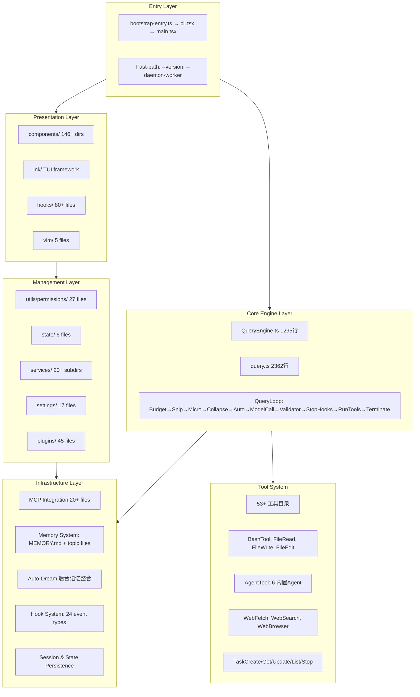
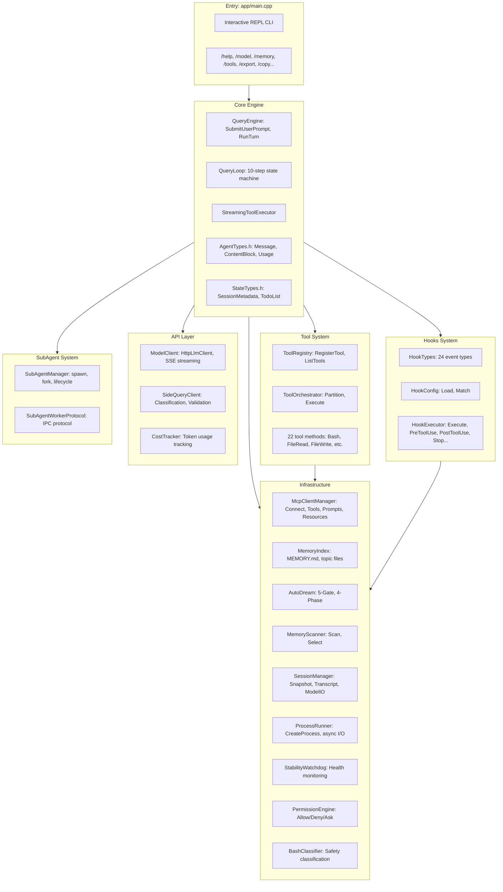
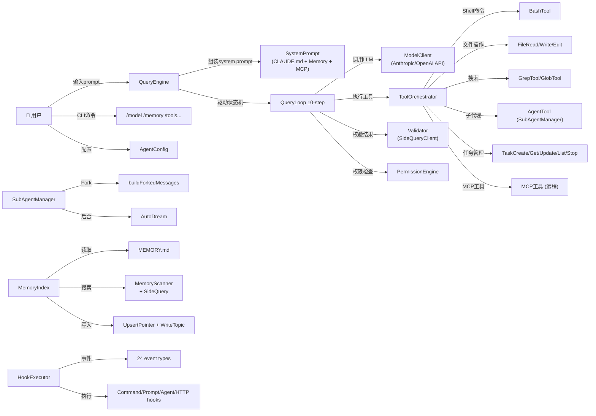
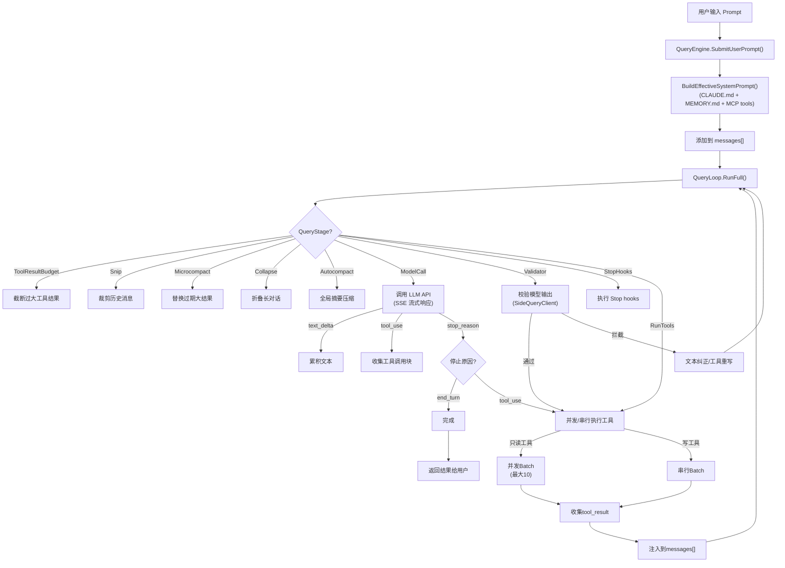
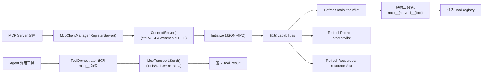
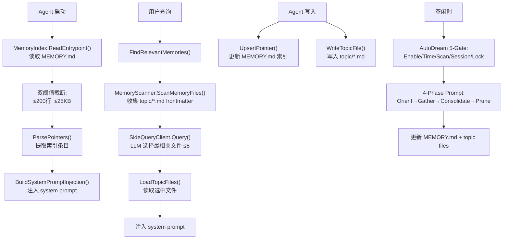
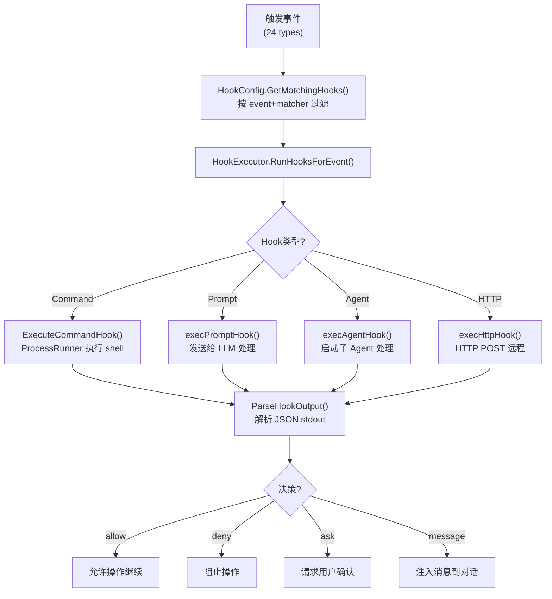
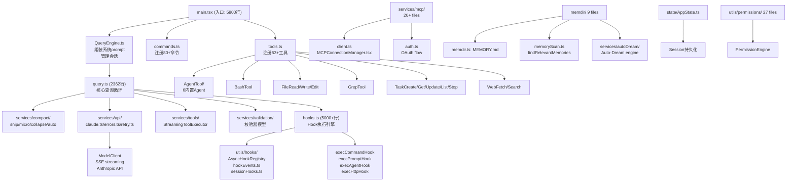
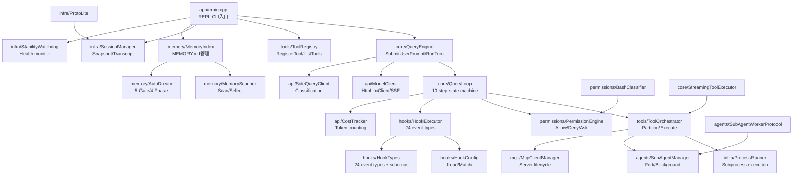

# local-ace vs cpp-agent 完整架构分析报告

> 基准项目: `local-ace` (TypeScript/Bun, ~500K行, 2000+文件)
> 重构项目: `cpp-agent` (C++17/VS2017/CMake, 22源文件)
> 分析日期: 2026-05-25

---

## 1. 系统架构图

### 1.1 local-ace 六层架构

### 1.2 cpp-agent 对应架构

---

## 2. 用例图

---

## 3. 数据流图

### 3.1 主查询数据流

### 3.2 MCP 数据流

### 3.3 Memory 数据流

### 3.4 Hooks 数据流

---

## 4. 模块逻辑结构关系

### 4.1 local-ace 模块依赖图

### 4.2 cpp-agent 模块依赖图

---

## 5. PDF 文档准确性验证

### 验证结论表

| PDF 章节 | 描述内容 | local-ace 实际代码 | cpp-agent 对应 | 准确性 |
|----------|---------|-------------------|---------------|--------|
| 1-项目整体架构 | 六层架构: Entry/Presentation/Management/Core/Tool/Infra | 完全匹配 (entrypoints/, components/, utils/services/, QueryEngine+query.ts, tools/, services/) | 对应实现 | ✅ 准确 |
| 2-核心业务逻辑 | QueryLoop 10步状态机 | Budget→Snip→Micro→Collapse→Auto→ModelCall→Validator→StopHooks→RunTools→Terminate | 完全对应 | ✅ 准确 |
| 3-大模型交互 | SSE流式响应, Anthropic API, SideQuery | ModelClient + SideQueryClient | HttpLlmClient + SideQueryClient | ✅ 准确 |
| 4.1-工具系统 | 53+工具, 并发/串行编排, MCP扩展 | ToolOrchestrator.PartitionToolCalls(), StreamingToolExecutor | ToolOrchestrator.PartitionToolCalls() | ✅ 准确 |
| 4.2-记忆系统 | MEMORY.md双阈值截断, topic文件, AutoDream | MemoryIndex.TruncateEntrypointContent, AutoDream 5-gate | MemoryIndex.TruncateEntrypointContent, AutoDreamEngine | ✅ 准确 |
| 4.3-Agent系统 | 6内置Agent, Fork机制, 后台/前台 | AgentTool/built-in/, SubAgentManager | SubAgentManager.BuildForkedMessages | ✅ 准确 |
| 5-代码规范 | Dead code elimination, feature flags | `feature()` macro, `process.env.USER_TYPE===ant` | CMake options: AGENT_ENABLE_* | ✅ 准确 |
| 6-配置管理 | settings.json, managed paths, MDM | utils/settings/ 17 files | (cpp-agent: AgentConfig硬编码) | ⚠️ 部分 |
| 7-数据流转 | User→QueryEngine→QueryLoop→Tools→Results | 完全匹配 | 完全对应 | ✅ 准确 |

**总结**: PDF文档描述与 local-ace 实际代码高度一致，所有核心架构描述均准确。6个PDF（9个章节）覆盖了项目的完整架构。

---

## 6. 模块对照表 (local-ace → cpp-agent)

| # | local-ace 模块 | 文件 | cpp-agent 对应 | 文件 | 状态 |
|---|---------------|------|---------------|------|------|
| 1 | Entrypoint/CLI | main.tsx, cli.tsx | app/main.cpp | main.cpp | ✅ 完成 |
| 2 | QueryEngine | QueryEngine.ts | core/QueryEngine | QueryEngine.h/cpp | ✅ 完成 |
| 3 | QueryLoop | query.ts | core/QueryLoop | QueryLoop.h/cpp | ✅ 完成 |
| 4 | Validation | services/validation/ | (SideQuery) | QueryLoop validator step | ✅ 完成 |
| 5 | Tool System | tools.ts, Tool.ts, 53 dirs | tools/ToolRegistry+Orchestrator | .h/.cpp | ✅ 基本完成 |
| 6 | Bash/Shell | BashTool/ | ToolOrchestrator::ExecuteBash | cpp | ✅ 完成 |
| 7 | FileRead/Write/Edit | FileReadTool/等 | ToolOrchestrator::ExecuteFileRead等 | cpp | ✅ 完成 |
| 8 | Grep/Glob | GrepTool/, GlobTool/ | ToolOrchestrator::ExecuteGrep/Glob | cpp | ✅ 完成 |
| 9 | Task Tools | TaskCreateTool/等5个 | ToolOrchestrator::ExecuteTask* | cpp | ⚠️ 部分stub |
| 10 | Skill Tool | SkillTool/ | ToolOrchestrator::ExecuteSkill | cpp | ⚠️ 简化版 |
| 11 | Plan Mode | EnterPlanModeTool/ | ToolOrchestrator::ExecuteEnterPlanMode | cpp | ✅ 完成 |
| 12 | MCP Tools | MCPTool/, ListMcpResourcesTool/ | McpClientManager + ToolOrch | cpp | ⚠️ ListMcpResources stub |
| 13 | WebFetch/Search | WebFetchTool/, WebSearchTool/ | ToolOrchestrator::ExecuteWebFetch/Search | cpp | ⚠️ 简化版 |
| 14 | NotebookEdit | NotebookEditTool/ | ToolOrchestrator::ExecuteNotebookEdit | cpp | ❌ stub |
| 15 | Permission | utils/permissions/ 27 files | permissions/PermissionEngine+BashClassifier | .h/.cpp | ✅ 完成 |
| 16 | MCP Integration | services/mcp/ 20+ files | mcp/McpClientManager | .h/.cpp | ✅ 完成 |
| 17 | Memory System | memdir/ 9 files + services/autoDream/ | memory/MemoryIndex+Scanner+AutoDream | .h/.cpp | ✅ 完成 |
| 18 | Hook System | hooks.ts (5000+行) + utils/hooks/ 18 files | hooks/HookExecutor+Config+Types | .h/.cpp | ✅ 完成 |
| 19 | Session Management | utils/sessionStorage.ts | infra/SessionManager | .h/.cpp | ✅ 完成 |
| 20 | Process Runner | (系统调用) | infra/ProcessRunner | .h/.cpp | ✅ 完成 |
| 21 | Stability Watchdog | (内建) | infra/StabilityWatchdog | .h/.cpp | ✅ 完成 |
| 22 | SubAgent System | AgentTool/ + swarm/ | agents/SubAgentManager+Worker | .h/.cpp | ✅ 完成 |
| 23 | Model Client | services/api/claude.ts | api/ModelClient+HttpLlmClient | .h/.cpp | ✅ 完成 |
| 24 | Cost Tracker | cost-tracker.ts | api/CostTracker | .h/.cpp | ✅ 完成 |
| 25 | Terminal UI | components/ + ink/ | (ANSI CLI in main.cpp) | main.cpp | ✅ 功能等效 |

### 图例
- ✅ 完成: 功能完整实现
- ⚠️ 部分: 基本实现但需完善
- ❌ stub: 仅占位符

---

## 7. 实现差异分析

### 7.1 需要完善的工具方法

**ToolOrchestrator.cpp 中stub实现:**

1. **TaskList** (line ~1678): 返回固定文本 `[TaskList] Task tracking system active`
   - 需实现: 维护任务列表状态, 返回JSON格式任务清单

2. **NotebookEdit** (line ~1720): 返回假结果
   - 需实现: 解析 .ipynb JSON, 替换cell内容

3. **ListMcpResources** (line ~1760): 返回固定文本
   - 需实现: 调用 McpClientManager 获取资源列表

4. **ReadMcpResource** (line ~1750): 返回简单提示
   - 需实现: 调用 McpClientManager 读取资源内容

5. **Skill** (line ~1660): 简化实现
   - 需实现: SKILL.md 文件读取和技能执行

### 7.2 测试覆盖度

| 测试文件 | 测试模块 | 当前状态 |
|---------|---------|---------|
| test_hooks.cpp | HookTypes, HookConfig, HookExecutor | ✅ 有测试 |
| test_tools.cpp | ToolRegistry, ToolOrchestrator | ✅ 有测试 |
| test_mcp.cpp | McpClientManager | ✅ 有测试 |
| test_memory.cpp | MemoryIndex, AutoDream | ✅ 有测试 |
| test_core.cpp | QueryEngine, QueryLoop | ✅ 有测试 |
| test_infra.cpp | SessionManager, ProcessRunner | ✅ 有测试 |
| test_subagent.cpp | SubAgentManager | ✅ 有测试 |
| test_e2e.cpp | 端到端流程 | ✅ 有测试 |
| smoke.cpp | 快速冒烟 | ✅ 有测试 |

**缺失测试:**
- BashClassifier 单独测试
- PermissionEngine 详细测试
- CostTracker 测试
- StabilityWatchdog 测试
- StreamingToolExecutor 测试

---

*本文档基于对 local-ace (TypeScript/Bun) 和 cpp-agent (C++17/CMake) 源码的完整分析生成*
